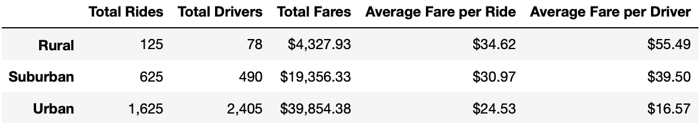
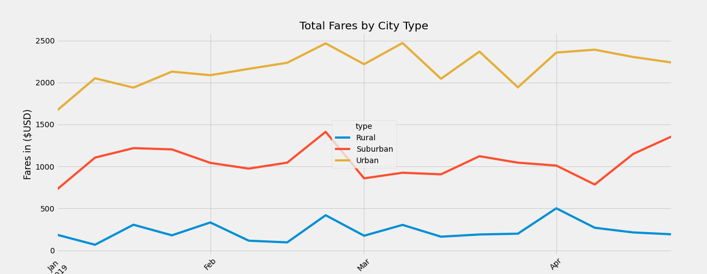

# Pyber Analysis
## Overview 
In this project we analyzed and created compelling visualizations from all the rideshare data obtained by PyBer, a ride-sharing app company, from January to early May of 2019.

### Purpose 
The purpose of this analysis was to find the differences in ride-sharing date for different city types (Urban, Suburban, and Rural) such as, the total number of riders, drivers, and fares for each type of city. With this data we were able to find averages for the cost of fares per ride and fares per driver.

## Results 
- First we found the total number of rides, drivers, and fares: 

### Total Rides per City Type
```
#  1. Get the total rides for each city type
urban_ride_count_ds = urban_city_df.groupby(["city"])["ride_id"].count()
suburban_ride_count_ds = suburban_city_df.groupby(["city"])["ride_id"].count()
rural_ride_count_ds = rural_city_df.groupby(["city"])["ride_id"].count()

urban_total_rides = urban_ride_count_ds.sum()
suburban_total_rides = suburban_ride_count_ds.sum()
rural_total_rides = rural_ride_count_ds.sum()
```

### Total Drivers per City Type
``` 
# 2. Get the total drivers for each city type
urban_driver_sum_ds = urban_city_df.groupby(["city"]).first()["driver_count"]
suburban_driver_sum_ds = suburban_city_df.groupby(["city"]).first()["driver_count"]
rural_driver_sum_ds = rural_city_df.groupby(["city"]).first()["driver_count"]

urban_total_drivers = urban_driver_sum_ds.sum()
suburban_total_drivers = suburban_driver_sum_ds.sum()
rural_total_drivers = rural_driver_sum_ds.sum()
```

### Total Fares per City Type
```
#  3. Get the total amount of fares for each city type
urban_fare_sum_ds = urban_city_df.groupby(["city"]).sum()["fare"]
suburban_fare_sum_ds = suburban_city_df.groupby(["city"]).sum()["fare"]
rural_fare_sum_ds = rural_city_df.groupby(["city"]).sum()["fare"]

urban_total_fares = urban_fare_sum_ds.sum()
suburban_total_fares = suburban_fare_sum_ds.sum()
rural_total_fares = rural_fare_sum_ds.sum()
```
- Then we used that data to find the average fare per driver for each city type:
### Average Fare per Ride per City Type
```
#  4. Get the average fare per ride for each city type. 
urban_avg_ride_fare = urban_total_fares / urban_total_rides
suburban_avg_ride_fare = suburban_total_fares / suburban_total_rides
rural_avg_ride_fare = rural_total_fares / rural_total_rides
```
### Average Fare per Driver per City Type
```
#  5. Get the average fare per driver for each city type. 
urban_avg_driver_fare = urban_total_fares / urban_total_drivers
suburban_avg_driver_fare = suburban_total_fares / suburban_total_drivers
rural_avg_driver_fare = rural_total_fares / rural_total_drivers
``` 
- Finally we created a DataFrame Summary of our analysis:
```
#  6. Create a PyBer summary DataFrame. 
pyber_summary_df = pd.DataFrame(
    {"Total Rides": [rural_total_rides, suburban_total_rides, urban_total_rides],
     "Total Drivers": [rural_total_drivers, suburban_total_drivers, urban_total_drivers],
     "Total Fares": [rural_total_fares, suburban_total_fares, urban_total_fares],
     "Average Fare per Ride": [rural_avg_ride_fare, suburban_avg_ride_fare, urban_avg_ride_fare],
     "Average Fare per Driver": [rural_avg_driver_fare, suburban_avg_driver_fare, urban_avg_driver_fare]})
```


From this DataFrame we can see that the total number of rides, drivers, and fares differ drastically between city types: rural cities having the smallest total amounts with only 125 rides, 78 drivers and $4,327 in fares, suburban in the middle with 625 rides, 490 drivers, and $19,356 in fares, and urban with by far the most has 1,625 rides, 2,405 drivers and $39,854 in fares.

- Next we created a line chart to compare and visualize the difference in fares between city types from Jan 1 2019 to April 29 2019 using code such as groupby, pivot tabels, and resample
### GroupBy
```
# Using groupby() to create a new DataFrame showing the sum of the fares for each date where the indices are the city type and date.

fares_per_date_df = pyber_data_df.groupby(["type","date"]).sum()[["fare"]]
```
### Pivot
```
# Create a pivot table with the 'date' as the index, the columns ='type', and values='fare' to get the total fares for each type of city by the date. 

table = fares_per_date_df.pivot(values="fare", index="date", columns="type")
```
### Resample
```
# Create a new DataFrame using the "resample()" function by week 'W' and get the sum of the fares for each week.

fares_per_week_df = table_new_df.resample("W").sum()
```
### Line chart using the object-oriented interface method
```
# Import the style from Matplotlib.
from matplotlib import style
# Use the graph style fivethirtyeight.
style.use('fivethirtyeight')


ax = fares_per_week_df.plot(figsize=(18,7))
ax.set_ylabel("Fares in ($USD)")
ax.set_title("Total Fares by City Type")
ax.tick_params(axis="x", labelrotation=45 )
```

From this chart we can see how much each city type produces in fares over the course of four months. Urban cities make the most with their fare average being over 2000 as displayed by the yellow line. Suburban cities hovers around $1000 with the red starting below the 1000 line going almost to 1500 before dropping back down below 1000 and again back up almost to 1500. Rural cities by fare yield the least amount of fares staying below 500 for all four months. 

## Summary 
Three business recommandations for the CEO would be:

1. To further analyze how efficient the city types are we could collect data of population size and perform an analysis say per 1000 people to see whether or not rural cities are underperforming.

2. There could also be many people who travel from the suburban cities to urban cities regularly for work which could be affecting the data and skeweing it in favor of urban cities. An analysis of daily commuters would help solve this disparity.

3. Another disparity could be the distance traveled. In urban cities everything is closer together than in suburban or rural affecting the cost of each fare. Urban cities had the lowest cost per fare while rural had the highest. 